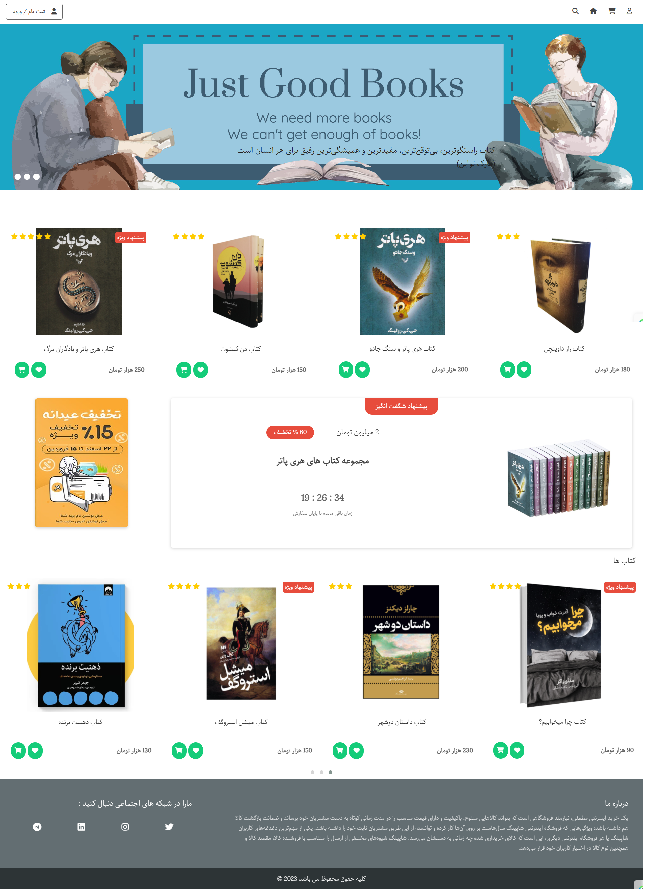
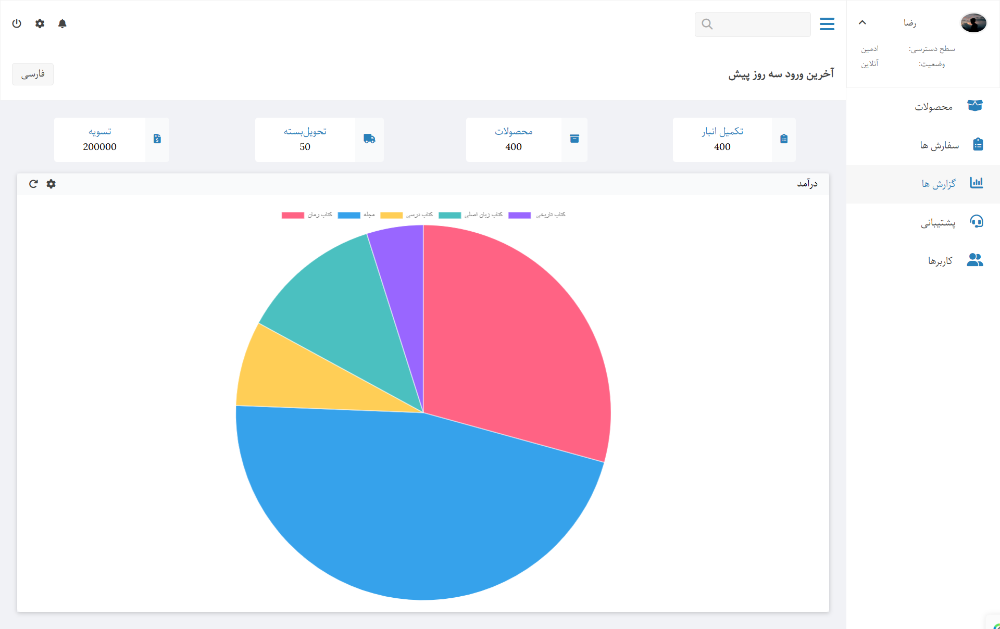
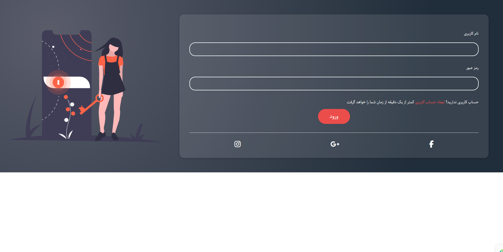

# 📚 BookStore Static Design (HTML & CSS Only)

# 📌 معرفی پروژه (Introduction)

این پروژه، یک طراحی فرانت‌اند (رابط کاربری) برای یک فروشگاه آنلاین کتاب و پنل مدیریت مرتبط است که به صورت کامل و صرفاً با استفاده از **HTML** و **CSS** خالص (Vanilla HTML/CSS) پیاده‌سازی شده است.

**هدف اصلی** : نمایش مهارت‌های طراحی لی‌آوت (Layout)، استفاده از Grid و Flexbox، و ایجاد یک UI (رابط کاربری) تمیز و مدرن بدون استفاده از فریم‌ورک‌های CSS (مانند Bootstrap یا Tailwind) یا جاوا اسکریپت.

---

# ⚠️ نکته مهم (Important Note)

**تکنولوژی** : این پروژه کاملاً استاتیک است و هیچ عملکرد بک‌اند (Backend) یا تعامل جاوا اسکریپتی (مانند دکمه‌های فعال یا فرم‌های ارسالی) ندارد.

**طراحی استاتیک** : طراحی این پروژه به صورت غیرریسپانسیو (**Non-Responsive**) و بهینه شده برای نمایش در صفحات دسکتاپ (عرض مشخص) پیاده‌سازی شده است.

---

# 🖼️ گالری (Screenshots)

| صفحه اصلی فروشگاه (Home) | پنل مدیریت (Admin Panel) | صفحه ورود (Login)      |
| ------------------------ | ------------------------ | ---------------------- |
|     |    |  |

---

# 🔗 لینک دمو (Live Demo)

شما می‌توانید نسخه زنده و دیپلوی شده این پروژه را در لینک زیر مشاهده کنید:

#### - 🌐 لینک سایت دمو: (https://reza-hajibabaei01.github.io/BookStore-Static-HTML-CSS/)

---

# 🛠️ تکنولوژی‌های استفاده شده (Tech Stack)

- HTML5
- CSS3
- فونت‌های فارسی (Local Fonts)

---

# 👤 توسعه‌دهنده (Author)

## [Reza Hajibabaei](https://github.com/Reza-Hajibabaei01)
